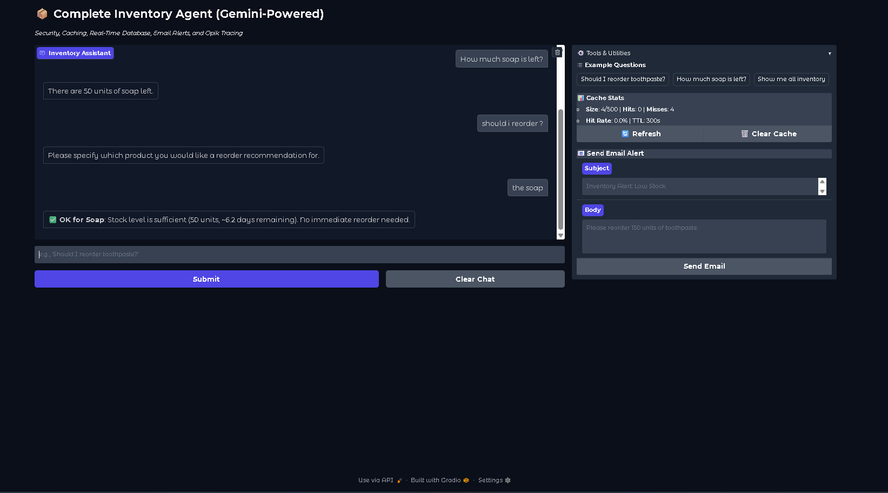

StockWise AI: An Intelligent Inventory Management Agent
StockWise AI is an advanced, AI-powered inventory management assistant built with LangChain, Google's Gemini Pro model, and a Gradio user interface. It leverages a modern Retrieval-Augmented Generation (RAG) architecture to answer natural language queries about inventory by interacting with a real-time SQLite database.

The assistant is fortified with robust security guardrails to prevent prompt injection and other malicious misuse, an intelligent caching layer to ensure high performance, and integrated observability for deep insights into the agent's behavior.

Core Features
Conversational AI Agent: A sophisticated LangChain agent powered by Google's Gemini Pro model understands complex user queries and interacts with backend tools to provide accurate analysis.

Real-time Database Integration: Connects to a local SQLite inventory database to provide the most current stock information, ensuring all recommendations are based on live data.

Intelligent Tooling: The agent is equipped with a suite of tools to perform specific tasks:

calculate_reorder_quantity: The primary tool for analyzing stock levels, demand, and lead times to provide direct, actionable reorder recommendations.

get_inventory_data: Fetches raw data for a specific product.

get_all_inventory: Provides a comprehensive summary of all items in the inventory.

Email Integration: Includes a utility to compose and send email alerts (e.g., for low stock) directly from the user interface.

Advanced Security & Performance:

Custom Input Guardrails: A built-in Guardrails class provides a critical layer of security by blocking prompt injections, preventing role-switching, and protecting system instructions.

Intelligent Caching: A custom InputCache class dramatically improves performance by caching responses to frequent questions, reducing API costs and providing near-instantaneous answers for repeated queries.

UI & Observability:

Interactive Web UI: A clean, user-friendly, and responsive interface built with Gradio.

Opik Tracing: Deeply integrated with Opik for full observability, allowing you to trace and debug the agent's entire execution flow.

Architecture
The application follows a modern, secure, and efficient RAG agent architecture:

User Input: A user asks a question through the Gradio UI (e.g., "Should I reorder toothpaste?").

Guardrail Evaluation: The input is first sanitized and validated by the Guardrails class. If the input is deemed unsafe, it is rejected immediately.

Cache Check: If the input is valid, the InputCache checks if an identical query has been answered recently. If a fresh, cached response exists, it's returned instantly (marked with a 🔄 emoji).

Agent Execution: If the query is not in the cache (a "cache miss"), it's passed to the LangChain AgentExecutor.

Tool Selection & Execution: The agent, guided by its system prompt, determines the best tool to use (e.g., calculate_reorder_quantity('toothpaste')).

Database Query: The selected tool connects to the SQLite database, retrieves the necessary data, and performs its calculation or analysis.

Response Generation: The data returned from the tool is passed back to the Gemini model, which formulates a human-readable, natural language response.

Update Cache & UI: The final response is stored in the cache for future use and is displayed to the user in the chatbot interface.

Getting Started
Follow these steps to set up and run the project locally.

1. Prerequisites
   Python 3.9+

Access to Google AI Studio for a GOOGLE_API_KEY

An Opik account for an OPIK_API_KEY

A Gmail account with an App Password for sending email alerts.

2. Installation
   Clone the repository:

git clone <your-repository-url>
cd <your-repository-folder>

Create and activate a Python virtual environment:

# For Windows

python -m venv myenv
myenv\Scripts\activate

# For macOS/Linux

python3 -m venv myenv
source myenv/bin/activate

Install the dependencies:

pip install -r requirements.txt

3. Configuration
   Create a file named .env in the root of the project.

Copy the contents of .env.example (if provided) or add the following variables, replacing the placeholder values with your actual credentials:

# Google API Key for Gemini

GOOGLE_API_KEY="YOUR_GOOGLE_API_KEY_HERE"

# Opik Tracing API Key

OPIK_API_KEY="YOUR_OPIK_API_KEY_HERE"

# Email Configuration (for Gmail)

EMAIL_HOST="smtp.gmail.com"
EMAIL_PORT=587
EMAIL_USER="your-email@gmail.com"
EMAIL_PASS="your-16-character-app-password"
EMAIL_TO="recipient-email@example.com"

4. Running the Application
   Execute the main script from your terminal:

python inventory_planner_final.py

Open your web browser and navigate to the local URL provided in the terminal (usually http://127.0.0.1:7860).

Technology Stack
Backend: Python

AI/LLM: Google Gemini Pro

Framework: LangChain

UI: Gradio

Database: SQLite

Observability: Opik
